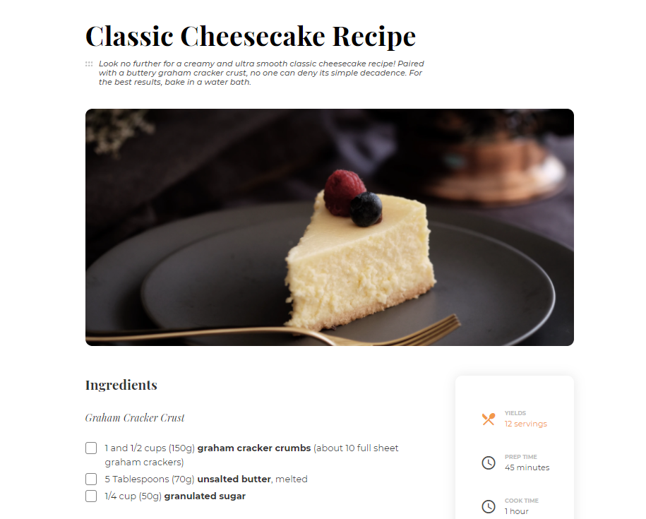

<!-- Please update value in the {}  -->

<h1 align="center">Recipe page
</h1>

   Solution for a challenge from  <a href="http://devchallenges.io" target="_blank">Devchallenges.io</a>.

  <h3>
    <a href="https://devchallenges-recipe-page-master.vercel.app/">
      Demo
    </a>
    <!--  | 
    <a href="https://{your-url-to-the-solution}">
      Solution
    </a> -->
     | 
    <a href="https://devchallenges.io/challenges/OEKdUZ6xs0h99C38XVht">
      Challenge
    </a>
  </h3>

<!-- TABLE OF CONTENTS -->

## Table of Contents

- [Overview](#overview)
- [Built With](#built-with)
- [Acknowledgements](#acknowledgements)
- [Contact](#contact)

<!-- OVERVIEW -->

## Overview

A cool classic challenge.  
It was not easy to keep the html lightweight in order to replicate the layout.

### Built With

<!-- This section should list any major frameworks that you built your project using. Here are a few examples.-->

- [Gulp](https://gulpjs.com/), which I used to compile sass, prefix and minify CSS, generate sourcemaps and cache busting postfixes (which is really cool) and also minify the images. I now have a basic gulpfile that I can reuse for my next projects.

## Acknowledgements

<!-- This section should list any articles or add-ons/plugins that helps you to complete the project. This is optional but it will help you in the future. For exmpale -->

- [W3schools.com](https://www.w3schools.com/howto/howto_css_custom_checkbox.asp)  
  I needed help in order to get the custom checkbox hover. Thank you ~ css selector !

## Contact

- Website [antoineteny.com](https://{your-web-site-link})
- GitHub [@antoineterny](https://{github.com/your-usermame})
